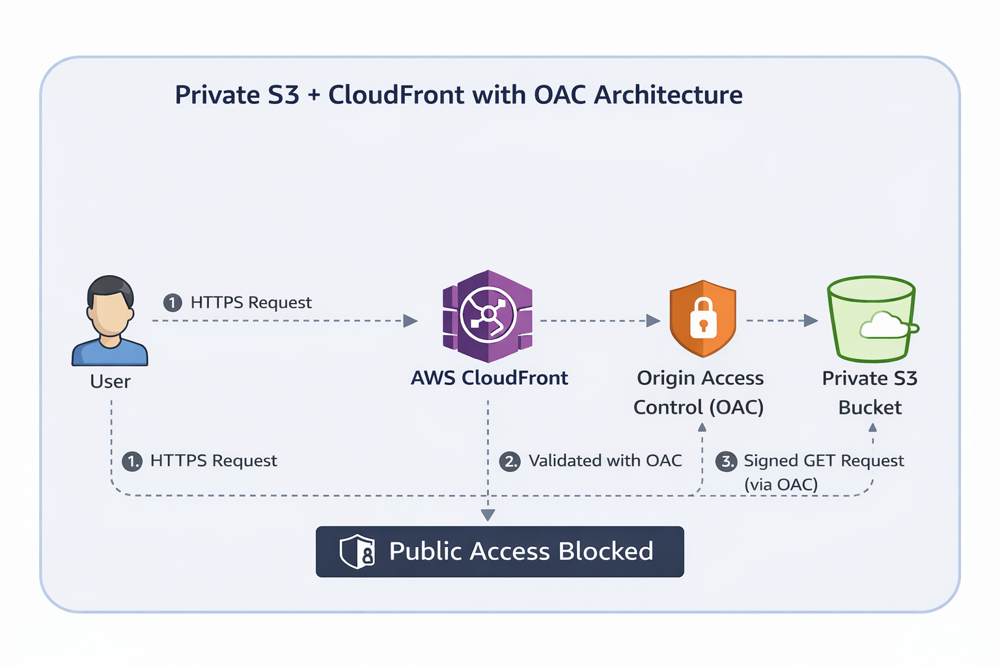

# 🚀 Secure Static Website Hosting using S3 + CloudFront (OAC) | IaC

## 📌 Project Summary

This project demonstrates a production-grade secure static website architecture built using AWS CloudFormation.

The architecture ensures:

- 🔐 S3 bucket remains completely private  
- 🌍 Content is delivered globally via CloudFront  
- 🔒 Access to S3 is restricted using Origin Access Control (OAC)  
- ⚙️ Entire infrastructure provisioned using Infrastructure as Code (IaC)  

This setup follows AWS Security Best Practices for static content delivery.

---

## 🏗️ Architecture Diagram



Direct access to S3 objects is fully blocked.

---

## 🧱 Infrastructure Components

### ✅ Amazon S3 (Private Bucket)

- Block All Public Access: Enabled  
- Server-side Encryption: AES256  
- Bucket Versioning: Enabled  
- Access allowed only via CloudFront  

---

### ✅ CloudFront Distribution

- HTTPS enforced (Redirect HTTP → HTTPS)  
- Default root object: `index.html`  
- Global edge caching enabled  
- Secure origin configuration  

---

### ✅ Origin Access Control (OAC)

- Signing Protocol: SigV4  
- Signing Behavior: Always  
- Ensures authenticated requests from CloudFront to S3  

---

### ✅ Secure Bucket Policy

- Uses `AWS:SourceArn` condition  
- Allows access only from specific CloudFront distribution  
- Prevents public and unauthorized access  

---

## 🧾 Sample Bucket Policy Snippet (YAML)

Below is a sample S3 bucket policy allowing access only from a CloudFront distribution using OAC:

```yaml
PolicyDocument:
  Version: "2012-10-17"
  Statement:
    - Sid: AllowCloudFrontAccess
      Effect: Allow
      Principal:
        Service: cloudfront.amazonaws.com
      Action: s3:GetObject
      Resource: arn:aws:s3:::your-bucket-name/*
      Condition:
        StringEquals:
          AWS:SourceArn: arn:aws:cloudfront::account-id:distribution/distribution-id
```

This ensures the S3 bucket cannot be accessed directly and only allows requests from the specified CloudFront distribution.

---

## 📤 CloudFormation Outputs

After stack creation, the following outputs are generated:

- **S3 Bucket Name**
- **CloudFront Distribution Domain URL**

The website is accessible only via the CloudFront HTTPS endpoint.

---

## 📸 Screenshots

### 📄 CloudFormation Template


### 📊 Stack Outputs


### 🔒 Private S3 Configuration


---

## 🚀 Deployment Steps

1. Open AWS CloudFormation Console  
2. Click Create Stack  
3. Upload the CloudFormation template  
4. Wait for status: CREATE_COMPLETE  
5. Access the website using the CloudFront URL from Outputs  

---

## 🎯 Key Learning Outcomes

- Implemented secure static hosting architecture  
- Configured CloudFront OAC with SigV4 signing  
- Wrote condition-based S3 bucket policies  
- Applied AWS security best practices  
- Deployed infrastructure using CloudFormation (IaC)  

---

## 💰 Cost Consideration

This architecture is cost-efficient for static website hosting:

- S3 storage cost is minimal  
- CloudFront charges based on requests and data transfer  
- No EC2 instances required (serverless model)  
- Suitable for portfolio and low-traffic applications  

---

## 📁 Repository Structure

```
aws-s3-cloudfront-static-website/
│
├── cloudformation/
│   └── s3-cloudfront-oac.yaml
│
├── docs/
│   └── architecture-img.png
│
├── screenshots/
│   ├── cloudformation-template.png
│   ├── stack-output.png
│   └── private-s3-settings.png
│
├── src/
│   ├── index.html
│   └── images/
│
└── README.md
```

---

## 🛠️ Technologies Used

- Amazon S3  
- Amazon CloudFront  
- Origin Access Control (OAC)  
- AWS CloudFormation  
- IAM Policies  

---

## 👨‍💻 Author

Thananjeyan Pandian (TJ)  
Aspiring AWS DevOps Engineer  

GitHub: https://github.com/Thananjeyan29  
LinkedIn: https://www.linkedin.com/in/thananjeyan-pandian-5aa204220/

---

⭐ If you found this project useful, feel free to star the repository and connect with me!
